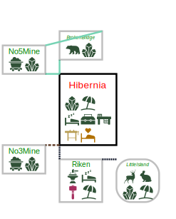
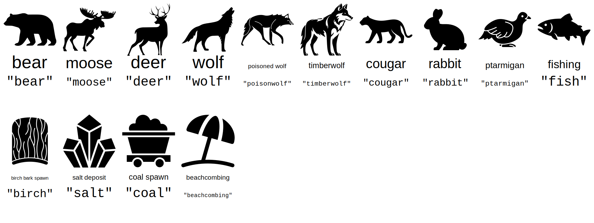
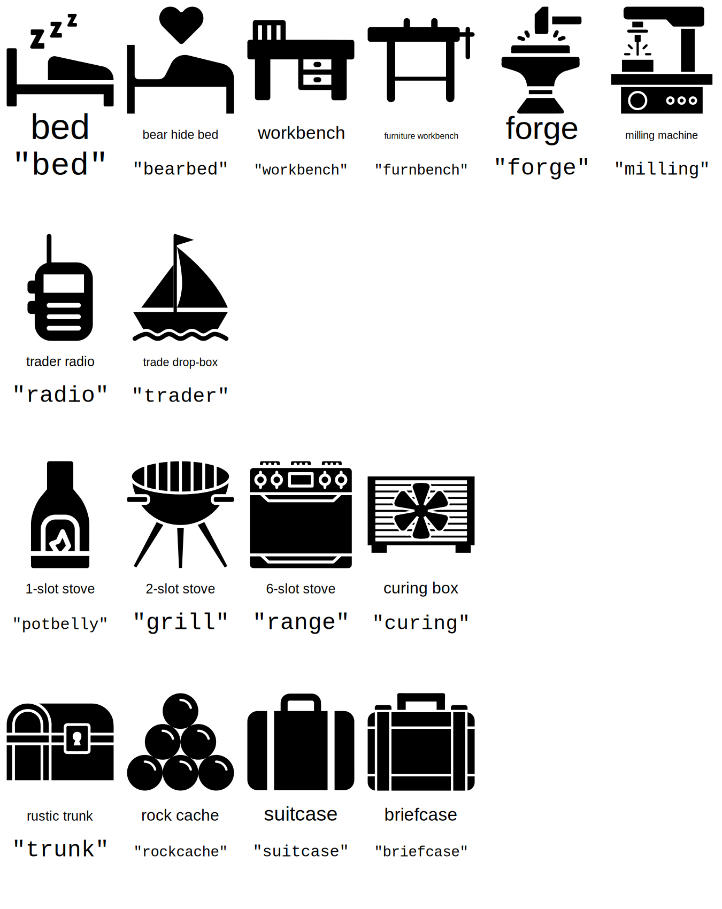
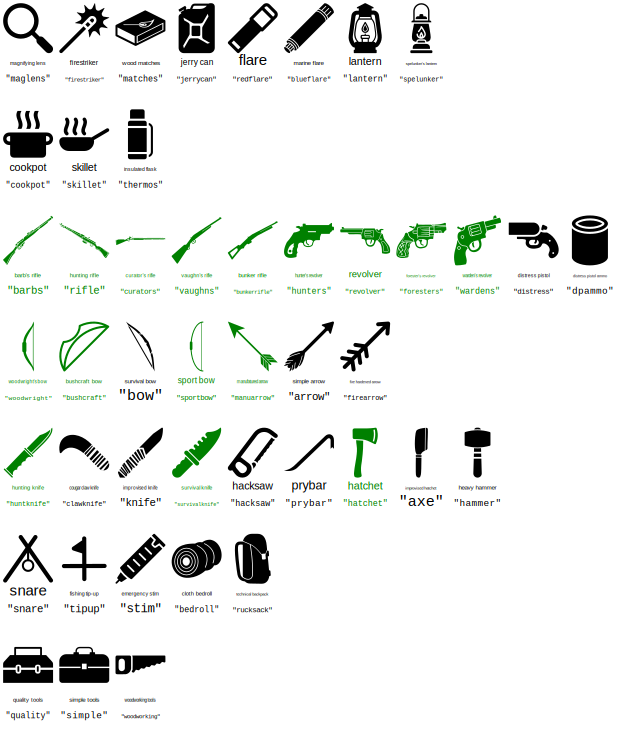
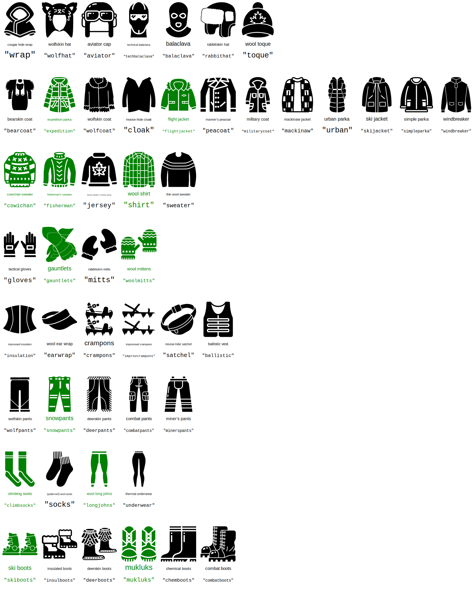
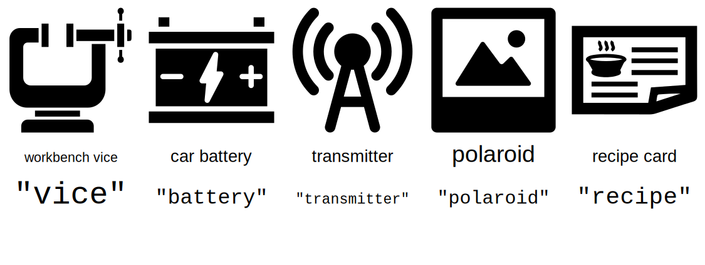

# TLDBaseViz
Visualization for safehouses in The Long Dark. _This is a work in progress!_

The purpose of this vizualizer is to give a bird's eye view of all one's bases in the game. Everything is SVG, meaning you can zoom in and out and the icons will scale nicely.

I'm currently using this vizualizer to keep track of all my bases in my current interloper game. Right now, it looks like:

## Dependencies
* [DrawSVG](https://github.com/cduck/drawsvg)
* [BeautifulSoup](https://pypi.org/project/beautifulsoup4/)

You can install them with:
`pip install drawsvg beautifulsoup`

## How to use
The visualizer takes its data from a JSON file which you provide as a command-line argument. Two example JSON files are provided: `mybases.json` and `loottable4.json`.

To run the visualizer: `python3 TLDBaseViz.py <inputFile.json>`

The input JSON has two sections: a list of bases, and a list of connections between the bases. A small vizualization might look something like this:

In this example, Hibernia and LonelyLighthouse have been explored, but the other locations have not, and are hence outlined in pink. Square boxes indicate indoor (warm) locations where one could cure a hide. Italics indicate there is no loading screen to access this location. 
The JSON entry for Hiberina is:

		"Hibernia":{
			"region": "DesolationPoint",
			"customizable": true,
			"loading": true,
			"cabinfeverrisk":true,
			"indoors": true,
			"explored":true,
			"features": ["salt,beachcombing",
						"bed, grill, workbench",
						"quality, -hammer",
						"#Cannery, +woodworking, +furnbench, +bearbed"
			]
		},

The icons are specified by the list `features`: each string is a row, and each string in the list is a column. Every icon has a specified keyword (e.g. `salt` is for salt deposit). There are three special prefixes:
* `-` is used to indicate something should be taken from this location (e.g. `-hammer`: you can see the nearby Riken has a `+hammer` showing where it should go). By default, cyan is used for this.
* `+` is used to indicate something should be brought to this location (e.g. `+woodworking`). By default pink is used for this.
* `#` is used to indicate a text box. This is useful for notes for yourself, such as if an item is coming or going far away. In the example above, `#Cannery` is a note I made to indicate the woodworkng tools are coming from the Cannery.

Connections are formatted as a list, and an excerpt looks like this:

		["Hibernia", "north", "top,left", "BrokenBridge", "bottom,left", "path"],
		["Hibernia", "south", "bottom,left", "Riken", "top,left", "charcoal"],
		["Riken", "east", "top,right", "LittleIsland", "top,left", "charcoal"],
		["No5Mine", "east", "bottom,right", "Hibernia", "top,left", "path"],

The format goes:
1. Name of source base
2. Direction from source base to sink (destination) base
3. Which corner of the source base's box the connection starts from
4. Name of sink base
5. Which corner of the sink base's box the connection ends at
6. A keyword used to style the connection. For example `path` for when a connection is readily navigated in low-visibility conditions thanks to a road, railroad, or natural path.  

You can change the colour scheme by editing `styling.json` as desired. A high contrast style file, `hicontraststyling.json` is also provided.

### The order of the bases in the JSON file matters
The order in which you list your bases in the JSON file affects the order in which they are drawn. The program draws bases in this order:
1. Draw the first base in the JSON file.
2. Draw all of the bases connected to that base.
3. Move to the second base in the JSON file. If it isn't already drawn, draw it. Then draw all of the bases connected to it.
4. Repeat #3 with the third base, fourth base, etc.

If your bases are appearing in janky locations, you may have to fuss with the order of the bases. If the program gets to a base but has no connections to it so far, it won't know where to put it, and will put it at the location of the first base.

### Icons available and their keywords
A full legend is avilable in `legend.csv`.
#### Natural resources

#### Furniture

#### Tools

#### Clothing
_Green indicates it is not available on interloper/misery._

#### Miscellaneous

#### Adding/changing icons
You can modify `legend.csv` to remap the keywords and add icons of your own.
If you want to add or modify the SVG icons, please be forewarned that the SVG parser is rather minimal, and presently only supports SVG files which are square in shape, have no layers, no relative paths, and no transformations. 

## Image Credits
Icons used here are all from The Noun Project unless otherwise noted. They are all Creative Commons licensed.
* [Aviator Cap by madness stock](https://thenounproject.com/icon/aviator-5501487/)
* [Balaclava by Juicy Fish](https://thenounproject.com/icon/balaclava-4337674/)
* [Ballistic Vest by Smashicons](https://thenounproject.com/icon/kevlar-vest-577374/)
* [Barb's Rifle by Hey Rabbit](https://thenounproject.com/icon/rifle-3563951/)
* [Beachcombing by Idwar](https://thenounproject.com/icon/workbench-6376294/)
* [Bear by abdul gofur](https://thenounproject.com/icon/bear-8141308/)
* [Bearskin Coat based on art by iconcheese](https://thenounproject.com/icon/trouser-3759142/), [Simon Child](https://thenounproject.com/icon/viking-8406/), and [Roundicons.com](https://thenounproject.com/icon/teddy-bear-1573805/) 
* [Bear Hide Bed by Luiz Carvalho](https://thenounproject.com/icon/bed-4353999/)
* [Bed by Adrien Coquet](https://thenounproject.com/icon/sleeping-947845/)
* [Bedroll by Daniel Shettel](https://thenounproject.com/icon/sleeping-bag-734845/)
* [Birch Bark by Amethyst Studio](https://thenounproject.com/icon/eucommia-bark-5464568/)
* [Bunker Rifle based on art by ka reemov](https://thenounproject.com/icon/shotgun-4424070/)
* [Briefcase based on art by Arkinasi](https://thenounproject.com/icon/briefcase-7768730/)
* [Car Battery by ARI NOFIANA](https://thenounproject.com/icon/car-battery-7134392/)
* [Chemical Boots by monkik](https://thenounproject.com/icon/rubber-boots-2343368/)
* [Climbing Socks by Agan24](https://thenounproject.com/icon/sock-7451160/)
* [Coal by BinikSol](https://thenounproject.com/icon/coal-6694219/)
* [Cookpot by NeueDeutsche](https://thenounproject.com/icon/cooking-671176/)
* [Combat Boots by Amethyst Studio](https://thenounproject.com/icon/combat-4284934/)
* [Combat Pants by Amethyst Studio](https://thenounproject.com/icon/clothes-3460975/)
* [Cougar by Sahiruddin](https://thenounproject.com/icon/black-panther-8130495/)
* [Cougar Claw Knife based on art by Abdullah Faisal](https://thenounproject.com/icon/knife-7071166/)
* [Cougar Hide Wrap based on art by Flowicon](https://thenounproject.com/icon/cloak-6064491/)
* [Cowichan Sweater by ferdizzimo](https://thenounproject.com/icon/sweater-4359556/)
* [Crampons based on art by Vectors Point](https://thenounproject.com/icon/sandal-3242123/)
* [Curator's Rifle by Jarem Frye](https://thenounproject.com/icon/black-powder-muzzleloader-1202077/)
* [Curing Box by Pham Duy Phuong Hung](https://thenounproject.com/icon/cooler-2133137/)
* [Deer by Anissa](https://thenounproject.com/icon/deer-5689542/)
* [Deerskin Boots based on art by Eucalyp](https://thenounproject.com/icon/moccasin-boots-4783273/)
* [Deerskin Pants based on art by Jajang Nurrahman](https://thenounproject.com/icon/trousers-6876585/)
* [Distress Pistol by Andy Horvath](https://thenounproject.com/icon/flare-gun-6660081/)
* [Distress Pistol Ammunition by Dwi Budiyanto](https://thenounproject.com/icon/cylinder-8139837/)
* [Emergency Stim by Andi Nur Abdillah](https://thenounproject.com/icon/epipen-6104972/)
* [Expedition Parka by Cik merry](https://tthenounproject.com/icon/winter-coat-6485467/)
* [Firestriker by IconMark](https://thenounproject.com/icon/flare-3507624/)
* [Fish by BnB Studio](https://thenounproject.com/icon/salmon-7911128/)
* [Fisherman's Sweater by Ayub Irawan](https://thenounproject.com/icon/wool-sweater-8116805/)
* Fishing Tip-up is original art for this project
* [Flight Jacket based on art by Zky Icon](https://thenounproject.com/icon/winter-coat-6984285/)
* [Forester's Revolver by Hey Rabbit](https://thenounproject.com/icon/revolver-3563944/)
* [Forge by Andi Nur Abdillah](https://thenounproject.com/icon/forge-7665279/)
* [Furniture Workbench by Deni Sudibyo](https://thenounproject.com/icon/workbench-6376294/)
* [Gauntlets based on art by Michael T](https://thenounproject.com/icon/gauntlets-991102/)
* [Grill (2-burner stove) by Cuby Design](https://thenounproject.com/icon/bachelor-griller-1916441/)
* [Hacksaw by omeneko](thenounproject.com/icon/hacksaw-7780613/)
* [Hatchet by Studio Danro](https://thenounproject.com/icon/hatchet-8158017/)
* [Heavy Hammer by Firza Alamsyah](https://thenounproject.com/icon/mallet-6908733/)
* [Hockey Jersey / Festive Sweater by Andry Horvath](https://thenounproject.com/icon/sweater-5130736/)
* [Hunter's Revolver by Graphic Nehar](https://thenounproject.com/icon/revolver-4109226/)
* [Hunting Knife by icongarage](https://thenounproject.com/icon/knife-5589049/)
* [Hunting Rifle by Hey Rabbit](https://thenounproject.com/icon/rifle-4932408/)
* [Improvised Crampons based on art by LSE Designs](https://thenounproject.com/icon/sandal-1245062/)
* [Improvised Hatchet by farra nugraha](https://thenounproject.com/icon/knife-7755681/)
* [Improvised Insulation based on art by Amethyst Stedio](https://thenounproject.com/icon/corset-5296859/)
* [Improvised Knife based on art by J703](https://thenounproject.com/icon/knife-5354803/)
* [Insulated Flask by AbtoCreative](https://thenounproject.com/icon/thermos-7022139/)
* [Insulated Boots by Side Project](https://thenounproject.com/icon/boots-8106551/)
* [Jerry Can by Nikita Kozin](https://thenounproject.com/icon/jerry-can-451668/)
* [Lantern by Athok](https://thenounproject.com/icon/lantern-8105507/)
* [Mackinaw Jacket based on art by ToZIcon](https://thenounproject.com/icon/jacket-5072903/)
* [Magnifying Lens by vectaicon](https://thenounproject.com/icon/search-6437462/)
* [Mariner's Pea Coat by Smallike](https://thenounproject.com/icon/jacket-2214264/)
* [Matches by Zach Bogart](https://thenounproject.com/icon/matchbook-4449825/)
* [Military Coat by Blackonion](https://thenounproject.com/icon/coat-6501999/)
* [Milling Machine by krisna agra muria](thenounproject.com/icon/milling-machine-7614302/)
* [Miner's Pants by pictranoosa](https://thenounproject.com/icon/fire-pants-5360970/)
* [Moose by pramana](https://thenounproject.com/icon/moose-7525270/)
* [Moose-Hide Cloak by Daniela Baptista](https://thenounproject.com/icon/jacket-788858/)
* [Moose-Hide Satchel by Amethyst Studio](https://thenounproject.com/icon/waist-bag-5466991/)
* [Mukluks by Eucalyp](https://thenounproject.com/icon/timberland-boots-4647930/)
* [Poisoned Wolf by icon trip](https://thenounproject.com/icon/wolf-6022272/)
* [Polaroid by Alice Design](https://thenounproject.com/icon/polaroid-2059579/)
* [Pot Belly Stove by Andrejs Kirma](https://thenounproject.com/icon/brick-oven-754885/)
* [Prybar by Ben Gilman](https://thenounproject.com/icon/crowbar-4068/)
* [Ptarmigan by Amethyst Studio](https://thenounproject.com/icon/willow-ptarmigan-4944602/)
* [Quality Tools by Asiah](https://thenounproject.com/icon/toolbox-7611362/)
* [Rabbit by Logisstudio](https://thenounproject.com/icon/rabbit-8111124/)
* [Rabbitskin Hat by Rafi Al Hakim](https://thenounproject.com/icon/winter-hat-6386514/)
* [Rabbitskin Mittens by Neneng Fadliyah](https://thenounproject.com/icon/mitten-6331269/)
* [Radio by NTT](https://thenounproject.com/icon/walkie-talkie-4532346/)
* [Range (6-burner stove) by Cuby Design](https://thenounproject.com/icon/stove-1916469/)
* [Recipe Card by Marianna Nardella](https://thenounproject.com/icon/recipe-card-291038/)
* [Revolver by Eskak](https://thenounproject.com/icon/revolver-8168224/)
* [Rock Cache by kusuma potter](thenounproject.com/icon/cannon-balls-7931465/)
* [Salt by Muhammad Hilmi Fajri](https://thenounproject.com/icon/mineral-7867358/)
* [Simple Parka by Siipkan Creative](https://thenounproject.com/icon/coat-5736592/)
* [Simple Tools by fauzin idea](https://thenounproject.com/icon/toolbox-8083102/)
* [Ski Boots by Lars Meiertoberens](https://thenounproject.com/icon/ski-boots-5326418/)
* [Ski Jacket based on art by ToZIcon](https://thenounproject.com/icon/raincoat-4957398/)
* [Skillet by icelloid](https://thenounproject.com/icon/frying-pan-6855632/)
* [Snare by Intervex](https://commons.wikimedia.org/wiki/File:Small_game_snare_icon.svg) [Wikimedia Commons]
* [Snowpants by Studio365](https://thenounproject.com/icon/pants-4690858/)
* [Spelunker's Lantern by Teny Septiani](https://thenounproject.com/icon/lantern-8126016/)
* [Suitcase by shashank singh](https://thenounproject.com/icon/suitcase-2860772/)
* [Survival Knife by Soremba](https://thenounproject.com/icon/knife-4460861/)
* [Tactical Gloves modified from art by Abu Ibrahim Icon](https://thenounproject.com/icon/gloves-7651028/)
* [Technical Backpack by johanna](https://thenounproject.com/icon/rucksack-580791/)
* [Technical Balaclava by P Thanga Vignesh](https://thenounproject.com/icon/balaclava-1588527/)
* [Thermal Underwear by Ainun Nadliroh](https://thenounproject.com/icon/tights-6343317/)
* [Thermal Underwear by Edi Prastyo](https://thenounproject.com/icon/long-john-4100147/)
* [Thin Wool Sweater by Jamil Akhtar](https://thenounproject.com/icon/sweater-7760127/)
* [Timberwolf by okja](https://thenounproject.com/icon/wolf-6260519/)
* [Trader by Salman Azzumardi](https://thenounproject.com/icon/sailboat-8101964/)
* [Transmitter by IconsHome](https://thenounproject.com/icon/antenna-7788531/)
* [Trunk (rustic) by Annisa](https://thenounproject.com/icon/treasure-chest-7189699/)
* [Urban Parka by James gibson](https://thenounproject.com/icon/padded-jumper-6393765/)
* [Vaughn's Rife by ka reemov](https://thenounproject.com/icon/shotgun-4424071/)
* [Warden's Revolver by Eskak](https://thenounproject.com/icon/revolver-8168232/)
* [Windbreaker by Lars Meiertoberens](https://thenounproject.com/icon/windbreaker-6792064/)
* [Wolf by IronSV](https://thenounproject.com/icon/wolf-3063417/)
* [Wolfskin Coat by Collicon](https://thenounproject.com/icon/jacket-2469520/)
* [Wolfskin Hat based on art by Amethyst Studio](https://thenounproject.com/icon/wolf-4132610/)
* [Wolfskin Pants modified from art by Jo Santos](https://thenounproject.com/icon/pants-6798118/)
* [Woodworking Tools by Berkah Icon](https://thenounproject.com/icon/saw-8128607/)
* [Wool Ear Wrap by parkjisun](https://thenounproject.com/icon/visor-414706/)
* [Wool Longjohns by Edi Prastyo](https://thenounproject.com/icon/long-john-4100147/)
* [Wool Mittens by Icon Market](https://thenounproject.com/icon/mitten-7686734/)
* [Wool Shirt by Amethyst Studio](https://thenounproject.com/icon/plaid-shirt-6355440/)
* [Wool Socks by Pong Pong](https://thenounproject.com/icon/socks-8036242/)
* [Wool Toque by Flatart](https://thenounproject.com/icon/beanie-2528655/)
* [Workbench by cdesign933](https://thenounproject.com/icon/desk-6717403/)
* [Workbench Vice by Melisa Lutfiani](https://thenounproject.com/icon/vice-6758814/)

## TODOs
### Icons to add
1. Icons for all accessories
5. Add bow, simple arrows, fire arrows (then non-interloper weapons)
6. Stacks of items like arrows
8. Add: Sewing kit? Can openers?
12. Wall art and rugs?
13. Separate icon for outdoor workbench?
15. Bear processing locations?

### Coding/UX
1. Add status "to find" distinct from "to bring" ('?')
2. Distinguish "bring item"  from "craft item" (e.g. rabbit mitts to TWM)
2. Add day # to visualization
1. Command-line override of style file
5. Opacity for probability doesn't work for dark background
3. Use legend.csv to verify counts
4. Automatic centring and canvas sizing (two-stage drawing?)... when redrawing, put the connections under the boxes
4. Automatic legend location
5. Indication of rope climbs
4. Write more documentation for other people to use it
7. Make loot table templates for interloper
9. Add some level of importance/priority?
10. Refine the dark mode / hi contrast style

## Acknowledgments
* See image credits!
* [TLD Interactive Map](https://elektronixx.github.io/TLD-Interactive-Map/) for helping me visualize how the regions connect