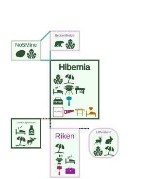
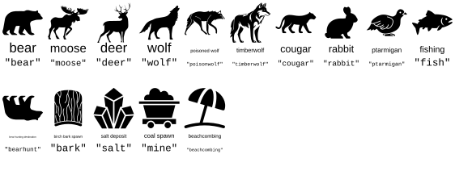
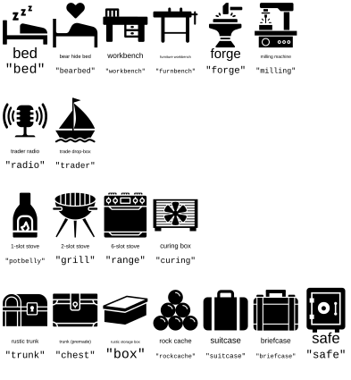
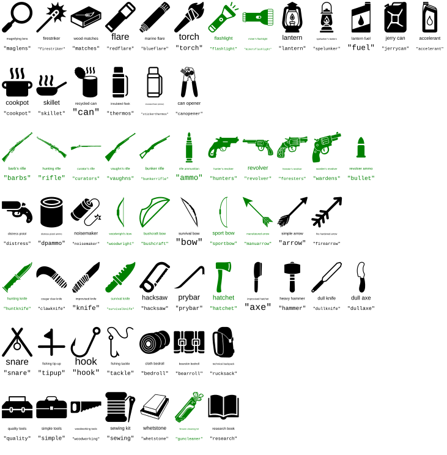
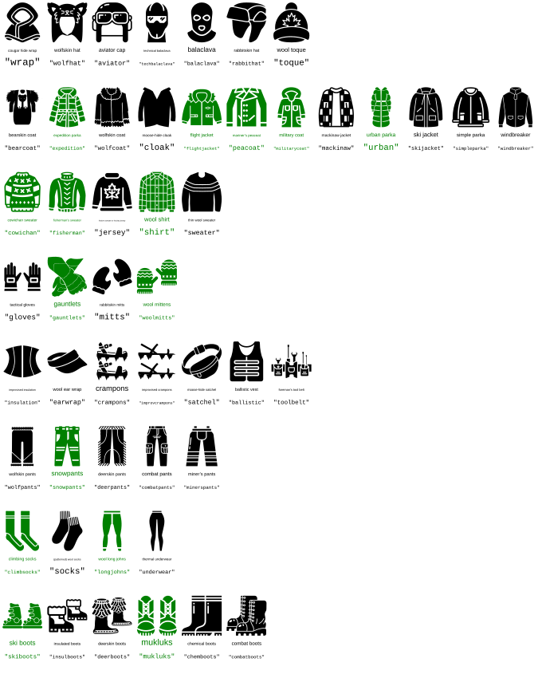
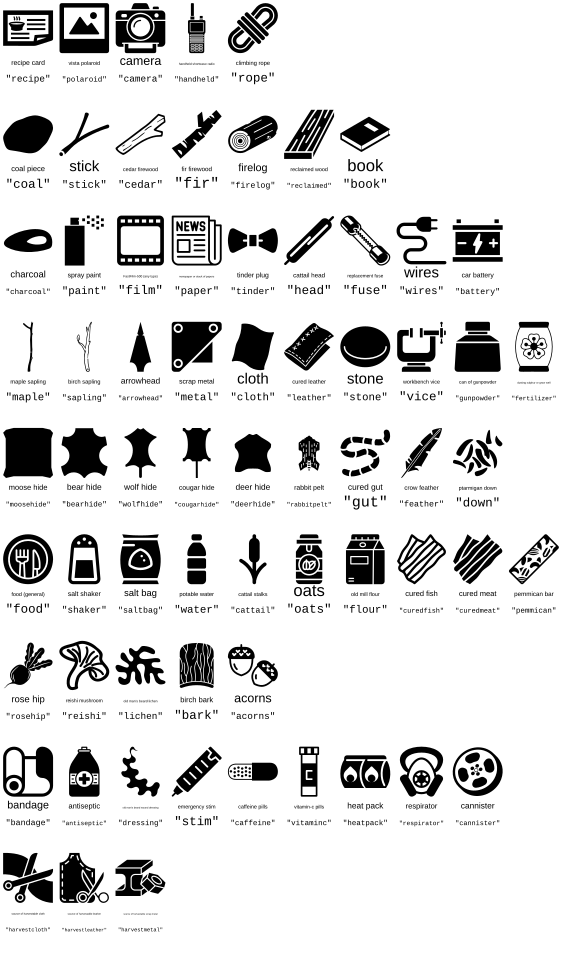

# TLDBaseViz
Visualization for safehouses in The Long Dark. _This is a work in progress!_

The purpose of this vizualizer is to give a bird's eye view of all one's bases in the game. Everything is SVG, meaning you can zoom in and out and the icons will scale nicely.

I'm currently using this vizualizer to keep track of all my bases in my current interloper game. Right now, it looks like:

## Dependencies
* [DrawSVG](https://github.com/cduck/drawsvg)
* [BeautifulSoup](https://pypi.org/project/beautifulsoup4/)

You can install them with:
`pip install drawsvg beautifulsoup`

## How to use
The visualizer takes its data from a JSON file which you provide as a command-line argument. Two example JSON files are provided: `mybases.json` and `loottable4.json`.

To run the visualizer: `python3 TLDBaseViz.py <inputFile.json>`

The input JSON has two sections: a list of bases, and a list of connections between the bases. A small vizualization might look something like this:

In this example, Hibernia, the No 5 Mine, and Lonely Lighthouse have been explored, but the other locations have not, and are hence outlined in purple. Square boxes indicate indoor (warm) locations where one could cure a hide. The opacity of the box's border indicates whether there is safehouse customization. Italics indicate there is no loading screen to access this location. 
The JSON entry for Hiberina is:

		"Hibernia":{
			"region": "DesolationPoint",
			"customizable": true,
			"loading": true,
			"cabinfeverrisk":true,
			"indoors": true,
			"explored":true,
			"features": ["salt,beachcombing",
						"bed, grill, workbench",
						"quality, -hammer",
						"#Cannery, +woodworking, +furnbench, +bearbed"
			]
		},

The icons are specified by the list `features`: each string is a row, and each string in the list is a column. Every icon has a specified keyword (e.g. `salt` is for salt deposit). There are three special prefixes:
* `-` is used to indicate something should be taken from this location (e.g. `-hammer`: you can see the nearby Riken has a `+hammer` showing where it should go). By default, cyan is used for this.
* `+` is used to indicate something should be brought to this location (e.g. `+woodworking`). By default pink is used for this.
* `#` is used to indicate a text box. This is useful for notes for yourself, such as if an item is coming or going far away. In the example above, `#Cannery` is a note I made to indicate the woodworkng tools are coming from the Cannery.
* `*` is used to indicate something should be produced (crafted) for this location (e.g. a furniture workbench).
* `?` is used to indicate something should be searched for at this location.

Connections are formatted as a list, and an excerpt looks like this:

		["Hibernia", "north", "top,left", "BrokenBridge", "bottom,left", "path"],
		["Hibernia", "south", "bottom,left", "Riken", "top,left", "charcoal"],
		["Riken", "east", "top,right", "LittleIsland", "top,left", "charcoal"],
		["No5Mine", "east", "bottom,right", "Hibernia", "top,left", "path"],

The format goes:
1. Name of source base
2. Direction from source base to sink (destination) base
3. Which corner of the source base's box the connection starts from
4. Name of sink base
5. Which corner of the sink base's box the connection ends at
6. A keyword used to style the connection. For example `path` for when a connection is readily navigated in low-visibility conditions thanks to a road, railroad, or natural path.  

You can change the colour scheme by editing `styling.json` as desired. A high contrast style file, `hicontraststyling.json` is also provided.

### The order of the bases in the JSON file matters
The order in which you list your bases in the JSON file affects the order in which they are drawn. The program draws bases in this order:
1. Draw the first base in the JSON file.
2. Draw all of the bases connected to that base.
3. Move to the second base in the JSON file. If it isn't already drawn, draw it. Then draw all of the bases connected to it.
4. Repeat #3 with the third base, fourth base, etc.

If your bases are appearing in janky locations, you may have to fuss with the order of the bases. If the program gets to a base but has no connections to it so far, it won't know where to put it, and will put it at the location of the first base.

### Icons available and their keywords
A full legend is avilable in `legend.csv`.
#### Natural resources

#### Furniture

#### Tools
_Green indicates it is not available on interloper/misery._

#### Clothing

#### Miscellaneous

#### Adding/changing icons
You can modify `legend.csv` to remap the keywords and add icons of your own.
If you want to add or modify the SVG icons, please be forewarned that the SVG parser is rather minimal, and presently only supports SVG files which are square in shape, have no layers, no relative paths, and no transformations. 

## Image Credits
Icons used here are all from The Noun Project unless otherwise noted. They are all Creative Commons licensed.
* [Accelerant by AFY Studio](thenounproject.com/icon/gasoline-6236830/)
* [Acorns by The Icon Z](https://thenounproject.com/icon/nuts-3846958/)
* [Antiseptic by projecthayat](https://thenounproject.com/icon/antiseptic-5918424/)
* [Arrowhead by Manja](https://thenounproject.com/icon/arrowhead-6157374/)
* [Aviator Cap by madness stock](https://thenounproject.com/icon/aviator-5501487/)
* [Backpack (container) by Andi wyianto](https://thenounproject.com/icon/shopping-bag-4879457/)
* [Balaclava by Juicy Fish](https://thenounproject.com/icon/balaclava-4337674/)
* [Ballistic Vest by Smashicons](https://thenounproject.com/icon/kevlar-vest-577374/)
* [Bandage by Side Project](https://thenounproject.com/icon/sleeping-mat-8074523/)
* [Barb's Rifle by Hey Rabbit](https://thenounproject.com/icon/rifle-3563951/)
* [Beachcombing by Idwar](https://thenounproject.com/icon/workbench-6376294/)
* [Bear by abdul gofur](https://thenounproject.com/icon/bear-8141308/) (also used for bear hunting destination)
* [Bear Hide by Yo! Baba](https://thenounproject.com/icon/leather-2388828/)
* [Bear Hide Bed by Luiz Carvalho](https://thenounproject.com/icon/bed-4353999/)
* [Bearskin Bedroll by Agan24](https://thenounproject.com/icon/bedroll-7451282/)
* [Bearskin Coat based on art by iconcheese](https://thenounproject.com/icon/trouser-3759142/), [Simon Child](https://thenounproject.com/icon/viking-8406/), and [Roundicons.com](https://thenounproject.com/icon/teddy-bear-1573805/) 
* [Bed by Adrien Coquet](https://thenounproject.com/icon/sleeping-947845/)
* [Bedroll by Daniel Shettel](https://thenounproject.com/icon/sleeping-bag-734845/)
* [Birch Bark by Amethyst Studio](https://thenounproject.com/icon/eucommia-bark-5464568/)
* [Birch Bark spawn by ochre7](https://thenounproject.com/icon/birch-tree-797763/)
* [Birch Sapling by endang firmansyah](https://thenounproject.com/icon/twig-7095842/)
* [Book by Dong Gyu Yang](thenounproject.com/icon/book-6380647/)
* [Box by Elin Erkani](https://thenounproject.com/icon/archive-7281787/)
* [Bunker Rifle based on art by ka reemov](https://thenounproject.com/icon/shotgun-4424070/)
* [Bushcraft Bow by Mask Icon](https://thenounproject.com/icon/bow-2420258/)
* [Briefcase by Dwi ridwanto](https://thenounproject.com/icon/suitcase-7787091/)
* [Cabinet by sentya irma](thenounproject.com/icon/cabinet-8048378/)
* [Caffeine Pills by Cards Against Humanity](thenounproject.com/icon/adderall-30133/)
* [Calendar by Galaxicon](https://thenounproject.com/icon/calendar-656473/)
* [Camera by Andi Nur Abdillah](https://thenounproject.com/icon/polaroid-camera-8007231/)
* [Can of Gunpowder by fauzan akbar](https://thenounproject.com/icon/ink-bottle-4586860/)
* [Can Opener by Amethyst Studio](https://thenounproject.com/icon/can-opener-5217861/)
* [Cannister by Dan Hetteix](https://thenounproject.com/icon/hubcap-196261/)
* [Car Battery by ARI NOFIANA](https://thenounproject.com/icon/car-battery-7134392/)
* [Cattail Head by Mohamed Mb](https://thenounproject.com/icon/reed-switch-996890/)
* [Cattail Stalk by ghufronagustian](https://thenounproject.com/icon/reed-3789187/)
* [Cedar Limb by Vectors Market](https://thenounproject.com/icon/cedar-tree-1925603/)
* [Cedar Firewood by qubodup](https://openclipart.org/detail/196360/black-and-white-broken-wooden-stick) [OpenClipArt]
* [Charcoal by Vectors Market](https://thenounproject.com/icon/massage-stones-1933016/)
* [Chemical Boots by monkik](https://thenounproject.com/icon/rubber-boots-2343368/)
* [Climb by Adrien Coquet](https://thenounproject.com/icon/climb-2195072/)
* [Climbing Rope by IYIKON](https://thenounproject.com/icon/rope-7694013/)
* [Climbing Socks by Agan24](https://thenounproject.com/icon/sock-7451160/)
* [Cloth by Rifqi Real](https://thenounproject.com/icon/cloth-5508914/)
* [Coal Piece by Sean Maldjian](https://thenounproject.com/icon/rock-3575775/)
* [Coal Spawn by BinikSol](https://thenounproject.com/icon/coal-6694219/)
* [Cookpot by NeueDeutsche](https://thenounproject.com/icon/cooking-671176/)
* [Combat Boots by Amethyst Studio](https://thenounproject.com/icon/combat-4284934/)
* [Combat Pants by Amethyst Studio](https://thenounproject.com/icon/clothes-3460975/)
* [Continued on next line by Ine shinta dewi](https://thenounproject.com/icon/next-3604263/)
* [Cougar by Sahiruddin](https://thenounproject.com/icon/black-panther-8130495/)
* [Cougar Hide by Amir Ali](https://thenounproject.com/icon/leather-5664362/)
* [Cougar Claw Knife based on art by Abdullah Faisal](https://thenounproject.com/icon/knife-7071166/)
* [Cougar Hide Wrap based on art by Flowicon](https://thenounproject.com/icon/cloak-6064491/)
* [Cowichan Sweater by ferdizzimo](https://thenounproject.com/icon/sweater-4359556/)
* [Crampons based on art by Vectors Point](https://thenounproject.com/icon/sandal-3242123/)
* [Crate (portable) by Isnaini](https://thenounproject.com/icon/crate-7149307/)
* [Crow Feather by Abd Majd](https://thenounproject.com/icon/feather-5425939/)
* [Curator's Rifle by Jarem Frye](https://thenounproject.com/icon/black-powder-muzzleloader-1202077/)
* [Cured Leather by Amethyst Studio](https://thenounproject.com/icon/garment-5368962/)
* [Cured Fish by c_ART_o](https://thenounproject.com/icon/bacon-7395894/)
* [Cured Meat by c_ART_o](https://thenounproject.com/icon/bacon-7395853/)
* [Curing Box by Pham Duy Phuong Hung](https://thenounproject.com/icon/cooler-2133137/)
* [Decoration by metami septiana](https://thenounproject.com/icon/decoration-7426915/)
* [Deer by Anissa](https://thenounproject.com/icon/deer-5689542/)
* [Deer Hide based on art by Smashicons](https://thenounproject.com/icon/leather-strap-830958/)
* [Deerskin Boots based on art by Eucalyp](https://thenounproject.com/icon/moccasin-boots-4783273/)
* [Deerskin Pants based on art by Jajang Nurrahman](https://thenounproject.com/icon/trousers-6876585/)
* [Distress Pistol by Andy Horvath](https://thenounproject.com/icon/flare-gun-6660081/)
* [Distress Pistol Ammunition by Dwi Budiyanto](https://thenounproject.com/icon/cylinder-8139837/)
* [Drawer (5kg) by Vectors Market](https://thenounproject.com/icon/archives-1456746/)
* [Drawer (10kg) by Dilon Choudhury](https://thenounproject.com/icon/desk-tray-192464/)
* [Dull knife by Nicko Studio](thenounproject.com/icon/icing-spatula-367489/)
* [Dull hatchet by Alex Chocron](https://thenounproject.com/icon/butter-knife-54277/)
* [Dusting Sulfur / Grown Well by Azam Ishaq](https://thenounproject.com/icon/seed-bag-6301316/)
* [Emergency Stim by Andi Nur Abdillah](https://thenounproject.com/icon/epipen-6104972/)
* [Expedition Parka by Cik merry](https://tthenounproject.com/icon/winter-coat-6485467/)
* [FastFilm-500 by Y](https://thenounproject.com/icon/film-7169719/)
* [Festive Lights by Amethyst Studio](thenounproject.com/icon/christmas-lights-6239099/)
* [Fir Firewood by Caro Asercion](https://commons.wikimedia.org/wiki/File:Birch-trees_-_Caro_Asercion_-_game-icons.svg) [Wikimedia Commons]
* [Fir Limb by Vectors Market](https://thenounproject.com/icon/fir-tree-1925599/)
* [Firestriker by IconMark](https://thenounproject.com/icon/flare-3507624/)
* [Firelog by Ronald Cortez](https://thenounproject.com/icon/log-65876/)
* [Fire Hardened Arrow by Zach Bogart](https://thenounproject.com/icon/archery-arrow-3169904/)
* [Firearm Cleaning Kit by Maria AG](https://thenounproject.com/icon/golf-bag-7075764/)
* [Fist Aid Container by ainul muttaqin](https://thenounproject.com/icon/first-aid-kit-4626993/)
* [Fish by BnB Studio](https://thenounproject.com/icon/salmon-7911128/)
* [Fishing Tackle by Aidan Stonehouse](https://thenounproject.com/icon/fishing-6712276/)
* [Fisherman's Sweater by Ayub Irawan](https://thenounproject.com/icon/wool-sweater-8116805/)
* Fishing Tip-up is original art for this project
* [Flare by Side Project](https://thenounproject.com/icon/flare-8177887/)
* [Flashlight by ajat sudrajat](https://thenounproject.com/icon/flashlight-8139921/)
* [Flight Jacket based on art by Zky Icon](https://thenounproject.com/icon/winter-coat-6984285/)
* [Floor by Free Fair & Healthy](https://thenounproject.com/icon/ground-1470114/)
* [Floppy Disk by Cuan Studio](https://thenounproject.com/icon/floppy-disk-5575706/)
* [Food by Abdul Matic](https://thenounproject.com/icon/food-8207935/)
* [Forester's Revolver by Hey Rabbit](https://thenounproject.com/icon/revolver-3563944/)
* [Foreman's Tool Belt by ahmadwil](https://thenounproject.com/icon/tool-belt-6589950/)
* [Forge by Andi Nur Abdillah](https://thenounproject.com/icon/forge-7665279/)
* [Freezer by Graphicxs_Art](thenounproject.com/icon/refrigerator-4633120/)
* [Fridge/Oven by Paonkz](https://thenounproject.com/icon/fridge-8311835/)
* [Furniture Workbench by Deni Sudibyo](https://thenounproject.com/icon/workbench-6376294/)
* [Gauntlets based on art by Michael T](https://thenounproject.com/icon/gauntlets-991102/)
* [Goating by Nick Novell](https://thenounproject.com/icon/goat-321011/)
* [Grill (2-burner stove) by Cuby Design](https://thenounproject.com/icon/bachelor-griller-1916441/)
* [Gut by Serena](https://thenounproject.com/icon/worm-7385327/)
* [Hacksaw by omeneko](thenounproject.com/icon/hacksaw-7780613/)
* [Handheld Shortwave Radio by Uswa KDT](https://thenounproject.com/icon/radio-4280696/)
* [Harvestable Cloth by Solid Icon Co](https://thenounproject.com/icon/textiles-7119943/)
* [Harvestable Leather by mangunkarsa](https://thenounproject.com/icon/sewing-scissors-8061445/)
* [Harvestable Scrap Metal by Slamlabs](https://thenounproject.com/icon/metal-6595542/)
* [Hatchet by Studio Danro](https://thenounproject.com/icon/hatchet-8158017/)
* [Heat Pack by Cattie](thenounproject.com/icon/charcoal-6517352/)
* [Heavy Hammer by Firza Alamsyah](https://thenounproject.com/icon/mallet-6908733/)
* [Hockey Jersey / Festive Sweater by Andry Horvath](https://thenounproject.com/icon/sweater-5130736/)
* [Hook by Andy Mc](https://thenounproject.com/icon/fish-hook-1213232/)
* [Horseshoe by Muhammad Nur Auliady Pamungkas](https://thenounproject.com/icon/horseshoe-8078569/)
* [Hunter's Revolver by Graphic Nehar](https://thenounproject.com/icon/revolver-4109226/)
* [Hunting Knife by icongarage](https://thenounproject.com/icon/knife-5589049/)
* [Hunting Rifle by Hey Rabbit](https://thenounproject.com/icon/rifle-4932408/)
* [Improvised Crampons based on art by LSE Designs](https://thenounproject.com/icon/sandal-1245062/)
* [Improvised Hatchet by farra nugraha](https://thenounproject.com/icon/knife-7755681/)
* [Improvised Insulation based on art by Amethyst Stedio](https://thenounproject.com/icon/corset-5296859/)
* [Improvised Knife based on art by J703](https://thenounproject.com/icon/knife-5354803/)
* [Insulated Flask by AbtoCreative](https://thenounproject.com/icon/thermos-7022139/)
* [Insulated Flask (sticker variant) by AbtoCreative](https://thenounproject.com/icon/thermos-7022308/)
* [Insulated Boots by Side Project](https://thenounproject.com/icon/boots-8106551/)
* [Jerry Can by Nikita Kozin](https://thenounproject.com/icon/jerry-can-451668/)
* [Lamp by Angriawan Ditya Zulkarnain](https://thenounproject.com/icon/lamp-1178621/)
* [Lantern by Athok](https://thenounproject.com/icon/lantern-8105507/)
* [Lantern Fuel by Justin Blake](https://thenounproject.com/icon/oil-165705/)
* [Lights by Melvin Salas](https://thenounproject.com/icon/christmas-lights-3993948/)
* [Location can be used to enter Safehouse Customization mode outdoors](thenounproject.com/icon/configure-951002/)
* [Locker by popcornarts](https://thenounproject.com/icon/locker-8275606/)
* [Mackinaw Jacket based on art by ToZIcon](https://thenounproject.com/icon/jacket-5072903/)
* [Magnifying Lens by vectaicon](https://thenounproject.com/icon/search-6437462/)
* [Manufactured Arrow by Leonardo Henrique Martini](https://thenounproject.com/icon/arrow-6704576/)
* [Maple Sapling by Blaise Sewell](https://thenounproject.com/icon/stick-80345/)
* [Marine Flare by Amethyst Studio](https://thenounproject.com/icon/signal-flare-5217088/)
* [Mariner's Pea Coat by Smallike](https://thenounproject.com/icon/jacket-2214264/)
* [Matches by Zach Bogart](https://thenounproject.com/icon/matchbook-4449825/)
* [Memento box (and key) by BGBOXXX Design](https://thenounproject.com/icon/briefcase-keys-1905055/)
* [Metal Container by Amethyst Studio](https://thenounproject.com/icon/carton-5097479/)
* [Military Coat by Blackonion](https://thenounproject.com/icon/coat-6501999/)
* [Miner's Flashlight by Amethyst Studio](https://thenounproject.com/icon/flashlight-4891978/)
* [Milling Machine by krisna agra muria](thenounproject.com/icon/milling-machine-7614302/)
* [Miner's Pants by pictranoosa](https://thenounproject.com/icon/fire-pants-5360970/)
* [Moose by pramana](https://thenounproject.com/icon/moose-7525270/)
* [Moose Hide based on art by Nhor](https://thenounproject.com/icon/leather-3394969/)
* [Moose-Hide Cloak by Daniela Baptista](https://thenounproject.com/icon/jacket-788858/)
* [Moose-Hide Satchel by Amethyst Studio](https://thenounproject.com/icon/waist-bag-5466991/)
* [Mukluks by Eucalyp](https://thenounproject.com/icon/timberland-boots-4647930/)
* [Nearby by Bagus Kusnandar](https://thenounproject.com/icon/nearby-2310449/)
* [Newspaper by Puspa Kusuma](https://thenounproject.com/icon/newspaper-7638057/)
* [Noisemaker by Azland Studio](https://thenounproject.com/icon/dynamite-7318966/)
* [Oats by Iconiyo](https://thenounproject.com/icon/oats-7259269/)
* [Old Man's Beard Lichen by Magicon](https://thenounproject.com/icon/lichen-299656/)
* [Old Man's Beard Wound Dressing by Zaach Bogart](https://thenounproject.com/icon/seaweed-3644863/)
* [Old Mill Flour by Contributor Icons](https://thenounproject.com/icon/flour-7881472/)
* [Outdoors (used for outdoor workbenches) by Uut Eva Ariani](thenounproject.com/icon/weather-7388265/)
* [Outside by Sujono sujono](https://thenounproject.com/icon/outside-arrow-3655944/)
* [Pemmican Bar by Llisole](https://thenounproject.com/icon/nuts-bar-4183125/)
* [Pillow by Tsundere Project](https://thenounproject.com/icon/pillow-5969315/)
* [Plastic Container by Ranah Pixel Studio](https://thenounproject.com/icon/plastic-containers-3765569/)
* [Poisoned Wolf by icon trip](https://thenounproject.com/icon/wolf-6022272/)
* [Polaroid by Alice Design](https://thenounproject.com/icon/polaroid-2059579/)
* [Pot Belly Stove by Andrejs Kirma](https://thenounproject.com/icon/brick-oven-754885/)
* [Prybar by Ben Gilman](https://thenounproject.com/icon/crowbar-4068/)
* [Ptarmigan by Amethyst Studio](https://thenounproject.com/icon/willow-ptarmigan-4944602/)
* [Ptarmigan Down by Gan Khoon Lay](https://thenounproject.com/icon/bones-pieces-597205/)
* [Quality Tools by Asiah](https://thenounproject.com/icon/toolbox-7611362/)
* [Rabbit by Logisstudio](https://thenounproject.com/icon/rabbit-8111124/)
* [Rabbit Pelt based on art by Eucalpy](https://thenounproject.com/icon/fur-pelt-3159393/)
* [Rabbitskin Hat by DTNS Studio](https://thenounproject.com/icon/ushanka-5849964/)
* [Rabbitskin Mittens by Neneng Fadliyah](https://thenounproject.com/icon/mitten-6331269/)
* [Radio by Arif Arisandi](https://thenounproject.com/icon/podcast-4678161/)
* [Range (6-burner stove) by Cuby Design](https://thenounproject.com/icon/stove-1916469/)
* [Recipe Card by Marianna Nardella](https://thenounproject.com/icon/recipe-card-291038/)
* [Reclaimed Wood by Adrien Coquet](https://thenounproject.com/icon/wood-3968912/)
* [Recycled Can by S. Salinas](https://thenounproject.com/icon/can-85822/)
* [Reishi Mushroom by Amando Hua](https://thenounproject.com/icon/mushroom-8284236/)
* [Replacement Fuse by M. Tohirin](https://thenounproject.com/icon/fuse-7799062/)
* [Research Book by bellvania naomi argi pramana](https://thenounproject.com/icon/book-7748809/)
* [Respirator by cakslankers](https://thenounproject.com/icon/respirator-8276636/)
* [Revolver by Eskak](https://thenounproject.com/icon/revolver-8168224/)
* [Revolver Ammunition by basticon](https://thenounproject.com/icon/bullet-5609630/)
* [Rifle Ammunition by rizal2109](https://thenounproject.com/icon/bullet-7460000/)
* [Rock Cache by kusuma potter](thenounproject.com/icon/cannon-balls-7931465/)
* [Rose Hip by T. Kiefer Robertson](https://thenounproject.com/icon/radish-6408854/)
* [Rug by tezar tantular](https://thenounproject.com/icon/carpet-8224214/)
* [Rug (bath mat style) by Phạm Thanh Lộc](https://thenounproject.com/icon/bath-mat-2431047/)
* [Rustic Storage Box by Marc Anderson](thenounproject.com/icon/shoe-box-20246/)
* [Safe by Jonn Tronic](https://thenounproject.com/icon/safe-29193/)
* [Salt Bag by IconMark](https://thenounproject.com/icon/sugar-4563132/)
* [Salt Deposit by Muhammad Hilmi Fajri](https://thenounproject.com/icon/mineral-7867358/)
* [Salt Shaker by Adrien Coquet](https://thenounproject.com/icon/salt-2120972/)
* [Scrap Metal by Ivanda Arief Budiarto](https://thenounproject.com/icon/bracket-4821002/)
* [Sewing Kit by iconisme](https://thenounproject.com/icon/sewing-kit-7584407/)
* [Shelf by Creative Stall](https://thenounproject.com/icon/bookshelf-6667578/)
* [Shelf (wall-attached) by Sembodo Tioss Halala](helf-5977791)
* [Simple Arrow by Sahab Uddin](https://thenounproject.com/icon/archery-4143091/)
* [Simple Parka by Siipkan Creative](https://thenounproject.com/icon/coat-5736592/)
* [Simple Tools by fauzin idea](https://thenounproject.com/icon/toolbox-8083102/)
* [Ski Boots by Lars Meiertoberens](https://thenounproject.com/icon/ski-boots-5326418/)
* [Ski Jacket based on art by ToZIcon](https://thenounproject.com/icon/raincoat-4957398/)
* [Skillet by icelloid](https://thenounproject.com/icon/frying-pan-6855632/)
* [Snare by Intervex](https://commons.wikimedia.org/wiki/File:Small_game_snare_icon.svg) [Wikimedia Commons]
* [Snowpants by Studio365](https://thenounproject.com/icon/pants-4690858/)
* [Spelunker's Lantern by Teny Septiani](https://thenounproject.com/icon/lantern-8126016/)
* [Sport Bow by TRAVIS BIRD](https://thenounproject.com/icon/bow-1519794/)
* [Spray Paint by Kemesh Maharjan](thenounproject.com/icon/spray-can-248886/)
* [Stick by Delapouite](https://commons.wikimedia.org/wiki/File:Water-diviner-stick_-_Delapouite_-_game-icons.svg) [Wikipedia Commons]
* [Stone by Amethyst Studio](https://thenounproject.com/icon/clay-pebbles-5683178/)
* [Suitcase by shashank singh](https://thenounproject.com/icon/suitcase-2860772/)
* [Supply Bin by Deemak Daksina](https://thenounproject.com/icon/dumpster-2128065/)
* [Supply Cache by Gregor Cresnar](https://thenounproject.com/icon/wireless-charging-539757/)
* [Survival Bow by Anditii Creative](https://thenounproject.com/icon/bow-archer-7655054/)
* [Survival Knife by Soremba](https://thenounproject.com/icon/knife-4460861/)
* [Tactical Gloves modified from art by Abu Ibrahim Icon](https://thenounproject.com/icon/gloves-7651028/)
* [Technical Backpack by johanna](https://thenounproject.com/icon/rucksack-580791/)
* [Technical Balaclava by P Thanga Vignesh](https://thenounproject.com/icon/balaclava-1588527/)
* [Thermal Underwear by Ainun Nadliroh](https://thenounproject.com/icon/tights-6343317/)
* [Thermal Underwear by Edi Prastyo](https://thenounproject.com/icon/long-john-4100147/)
* [Thin Wool Sweater by Jamil Akhtar](https://thenounproject.com/icon/sweater-7760127/)
* [Timberwolf by okja](https://thenounproject.com/icon/wolf-6260519/)
* [Tinder Plug by Rikas Dzihab](thenounproject.com/icon/bowtie-7442280/)
* [Torch by Darwin Mulya](https://thenounproject.com/icon/torch-7829127/)
* [Trader by Salman Azzumardi](https://thenounproject.com/icon/sailboat-8101964/)
* [Transmitter by IconsHome](https://thenounproject.com/icon/antenna-7788531/)
* [Trash Can by Adeel rehman](https://thenounproject.com/icon/dustbin-5746658/)
* [Trunk (rustic) by Annisa](https://thenounproject.com/icon/treasure-chest-7189699/)
* [Trunk (premade) by Chintuza](https://thenounproject.com/icon/chest-3106198/)
* [Urban Parka by James gibson](https://thenounproject.com/icon/padded-jumper-6393765/)
* [Vaughn's Rife by ka reemov](https://thenounproject.com/icon/shotgun-4424071/)
* [Vitamin-C Pills by Studio 365](https://thenounproject.com/icon/diet-supplement-4482553/)
* [Warden's Revolver by Eskak](https://thenounproject.com/icon/revolver-8168232/)
* [Washing Machine by Yosua Bungaran](https://thenounproject.com/icon/washing-machine-8325696/)
* [Water Bottle by Hilmy Abiyyu Asad](https://thenounproject.com/icon/water-bottle-8270656/)
* Whetstone is original art for this project
* [Windbreaker by Lars Meiertoberens](https://thenounproject.com/icon/windbreaker-6792064/)
* [Wires by Marie Van den Broeck](thenounproject.com/icon/plug-326742/)
* [Wolf by IronSV](https://thenounproject.com/icon/wolf-3063417/)
* [Wolf Hide based on art by Singlar](https://thenounproject.com/icon/leather-7911204/)
* [Wolfskin Coat by Collicon](https://thenounproject.com/icon/jacket-2469520/)
* [Wolfskin Hat based on art by Amethyst Studio](https://thenounproject.com/icon/wolf-4132610/)
* [Wolfskin Pants modified from art by Jo Santos](https://thenounproject.com/icon/pants-6798118/)
* [Woodworking Tools by Berkah Icon](https://thenounproject.com/icon/saw-8128607/)
* [Woodwright's Bow by Simon Henrotte](https://thenounproject.com/icon/bow-22927/)
* [Wool Ear Wrap by parkjisun](https://thenounproject.com/icon/visor-414706/)
* [Wool Longjohns by Edi Prastyo](https://thenounproject.com/icon/long-john-4100147/)
* [Wool Mittens by Icon Market](https://thenounproject.com/icon/mitten-7686734/)
* [Wool Shirt by Amethyst Studio](https://thenounproject.com/icon/plaid-shirt-6355440/)
* [Wool Socks by Pong Pong](https://thenounproject.com/icon/socks-8036242/)
* [Wool Toque by Flatart](https://thenounproject.com/icon/beanie-2528655/)
* [Workbench by cdesign933](https://thenounproject.com/icon/desk-6717403/)
* [Workbench Vice by Melisa Lutfiani](https://thenounproject.com/icon/vice-6758814/)

## TODOs

### Drawing-related
1. Rethink how draw the graph so position doesn't need so much manual tweaking
2. Stitch the coord-based maps together. Figure out how to handle the fact that AC-TWM-PV-KP-BRM does not have a shared point with most of island, and that HRV and DP are similarly only  accessed via caves.
3. Visualize bases on this new graph
2. Reposition the inventory
1. Automatically split legend up to make it easier to fit
4. Automatic centring and canvas sizing (two-stage drawing?)... when redrawing, put the connections under the boxes
4. Automatic legend location
16. Arrows for one-way paths to indicate direction
17. Look into existing libraries, e.g.
    * https://memgraph.com/blog/graph-visualization-in-python 
    * https://github.com/paulbrodersen/netgraph/tree/master 
    * https://plotly.com/python/network-graphs/ 
    * https://graphviz.org/docs/layouts/neato/ 

### Non-drawing features
1. Write more documentation for other people to use it
10. Refine the dark mode / hi contrast style
12. High-level view vs detail view
13. Location tiers and minimum supplies for each

### Template creation
1. Average across all four loot tables
9. Add where to BRING the polaroids
13. Tea & coffee
15. Crackers
8. RNG tables for cupboards, lockers, etc?
9. Once features seem stable, worry about placement of bases
10. Improve guesses as to locations of: pillows, batteries, DP ammo, the crampons in TWM, etc
11. Add any non-loot-table hacksaw, hammer, bedroll, maglens, firestriker, lantern: https://steamcommunity.com/sharedfiles/filedetails/?id=3027092241 
12. Check matches versus https://steamcommunity.com/sharedfiles/filedetails/?id=3027092241

### Locations to add (particularly for templates)
16. Add supply caches
17. Add hidden caches
10. ALL possible bear spawns

### Icons to add
1. Snow shelter
1. Burdock
2. Cooked acorns
3. Various teas?
4. Rustic & quilted beds
5. Tea
6. Coffee
7. Crackers

### Maybe later
1. Add some level of importance/priority?
11. Item weights in legend.csv

## Acknowledgments
* See image credits!
* [TLD Interactive Map](https://elektronixx.github.io/TLD-Interactive-Map/) for helping me visualize how the regions connect